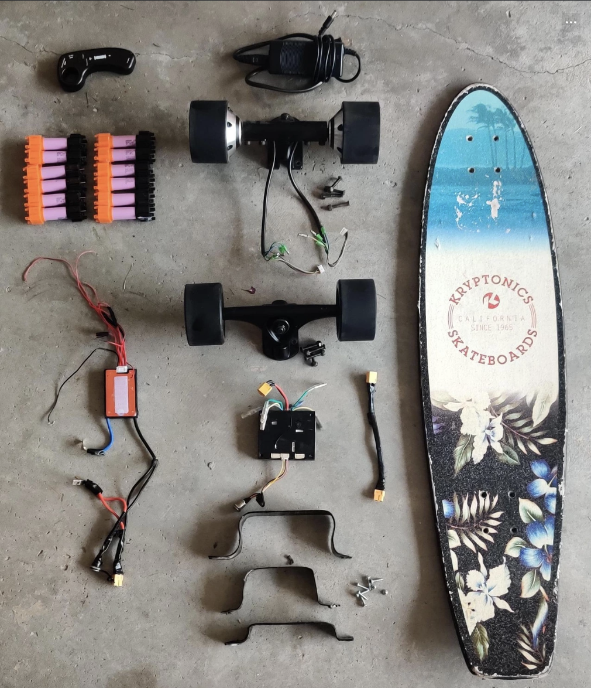
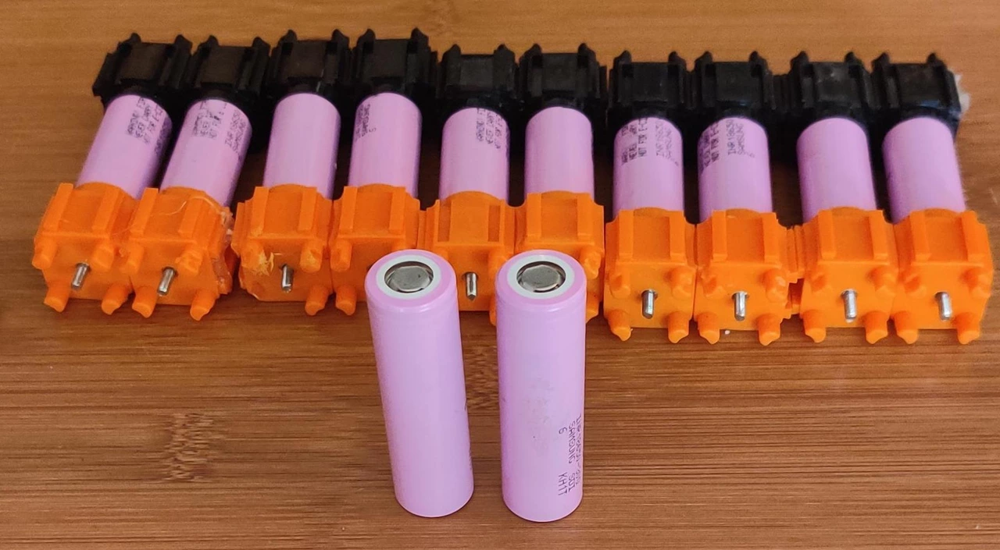
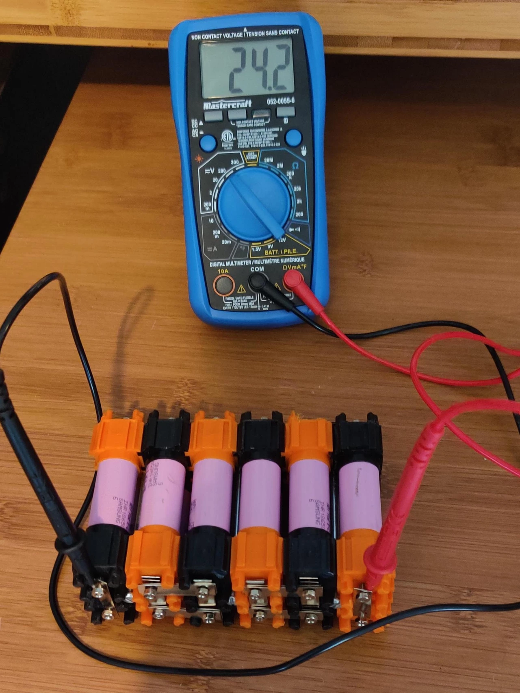
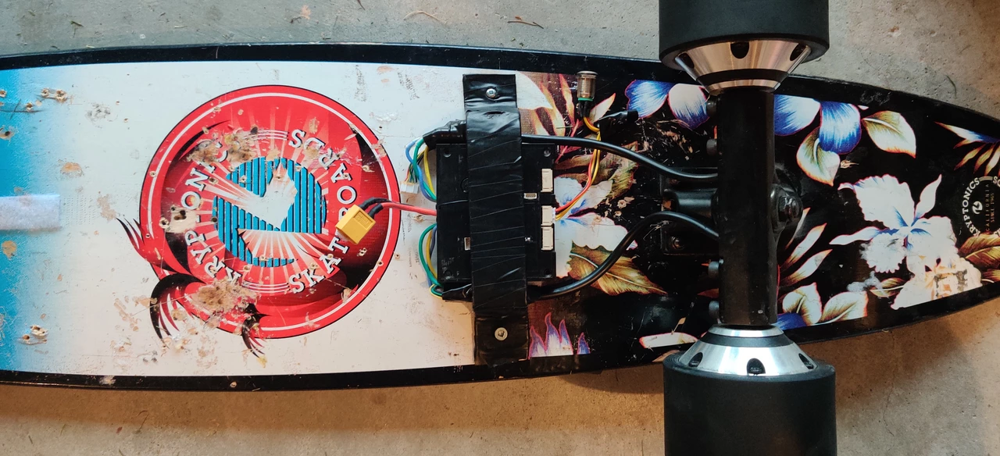

# Electric-Skateboard

### This project journal is meant as a walkthrough of my build process to put together this electric skateboard.  
 

### Before building I wanted to layout all my parts to get a feel for how everything would fit together before setting things down permanently.

### The first step was adding the wheels, for ease of use I decided to pick out these 90mm hub motors. I picked them for a couple of main reasons, primarily because if the battery died the lack of a belt driving motor means less resistance making it ridable even without power though a little heavy. Secondly, as this was my first time building an electric skateboard I wanted to be mindful that using a belt system invited for a lot more problems and maintenance issues down the line so this was a great starter.

### My next step was building the battery, I decided to use a no-solder kit as it made the ability to switch out cells and upgrade in the future very easy. Additionally, my choice of battery was the Samsung 30Q, I liked these batteries because they offered a really high capacity at 3000 mAh with a max current of 15 A allowing for a "slow burn."

### I decided to orient the batteries in a 6S2P format as it gave me a total of 6000 mAh with a strong enough voltage to still travel at high enough speeds for many km.

### After testing each cell I connected them using nickel strips and tested from the main positive and negative terminals.

### Next was to prepare the BMS (battery management system), in short this system allowed each battery to charge equally and make sure they operate safely overall.

### I then wired in the bms connecting it to main negative terminal and each positive terminal according to guidelines.

### After finishing the battery, I attached the ESC to the hub motors. The ESC acts as a bridge between the motors and battery while connecting with the hand held remote.

### I then soldered together an xt60 extension cable so I could place the battery on the front of the skateboard to balance out the weight. This concludes my electric skateboard build, the final result ended being better than I could have asked for being capable of 22 km/h with a range of 12 km. Overall a very successful project!
